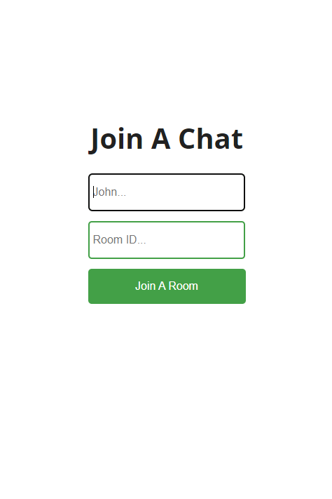
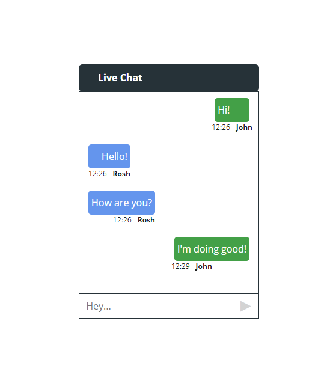

# Welcome Chat Room
A realtime full-stack chat application built using NodeJS and ReactJS along with socket.io

## Install dependencies
```
npm install
```

## Run the backend and client server separately by the same command.
```
npm run start
```

## Preview

<table>
  <tr>
    <td>Login Page</td>
    <td>Chat Page</td>
  </tr>
  <tr>
    <td>
    <td>
  </tr>
</table>
